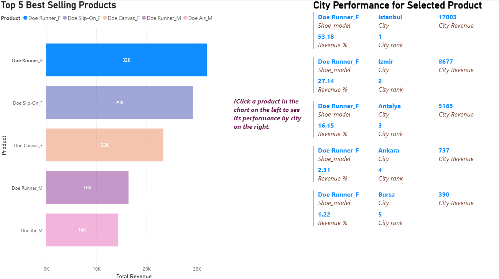
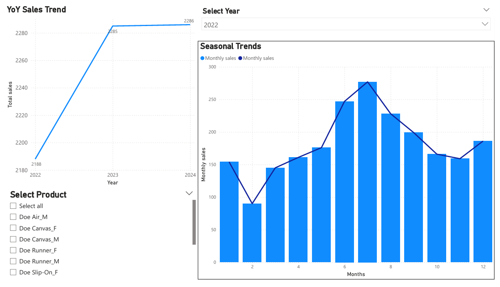

# 🚀 Footwear Sales Performance Dashboard
**Skills:** SQL, Power BI, Data Visualization
**ProjectS Summary:** See `docs/` for Project Summary.
**Report:** [Interactive .pbix](DoeShoes_Report.pbix) | [PDF Export](DoeShoes_Report.pdf)  

## 📌 Insights
- **Top Product:** Doe Runner_F (€32K revenue, 53% from Istanbul).  
- **Seasonal Peaks:** Summer (June-Aug) & Holidays (Dec).  
## 📸 Dashboard Previews

**Title Page**

**Product Performance Drilldown**

**Sales Trends**

## 🔍 How to Use
- Open `.pbix` in Power BI Desktop.  
- See `docs/` for SQL queries.  

## 📊 Data Sources
- `sales.csv`, `product.csv`, `store_cities.csv` (see `/data`).  
